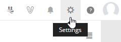
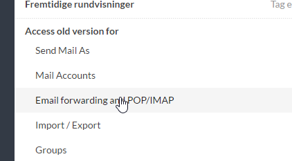
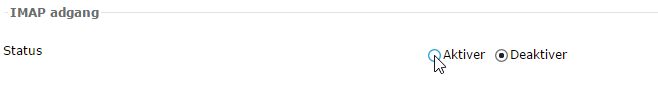

## Mail

### Webmail

Webmail kan findes på [zoho.com](http://www.zoho.com/mail/login.html)

### Opsætning af mailklienter

#### IMAP (anbefalet)

##### Aktiver IMAP ved Zoho

1. Log ind på webmail

2. Gå til settings

3. Vælg Email forwarding and POP/IMAP

4. Ud for status under IMAP, tryk aktiver.

5. Tilføj ny konto i det ønskede mailprogram. 

6. Ofte vil der være valgmuligheder som Office 365, Gmail, Exchange og anden. Vælg anden.

7. Sandsynligvis skal serveroplysningerne tastes ind manuelt. Vælg derfor manuel konfiguration (eller lignende).

8. Brug nedenstående oplysninger, når bedt om det.

9. Hvis der ikke er noget sted til indtastning af port og/eller sikkerhed, gemmer det sig måske blandt nogle advancerede indstillinger. Eller også har programmet ikke behov for at få det indtastet. 

Indkommende server: 

- imappro.zoho.com, 
- Port: 993, 
- Sikkerhed: SSL

Udgående server: 

- smtp.zoho.com, 
- Port: 465, 
- Sikkerhed: SSL

## Andre links

